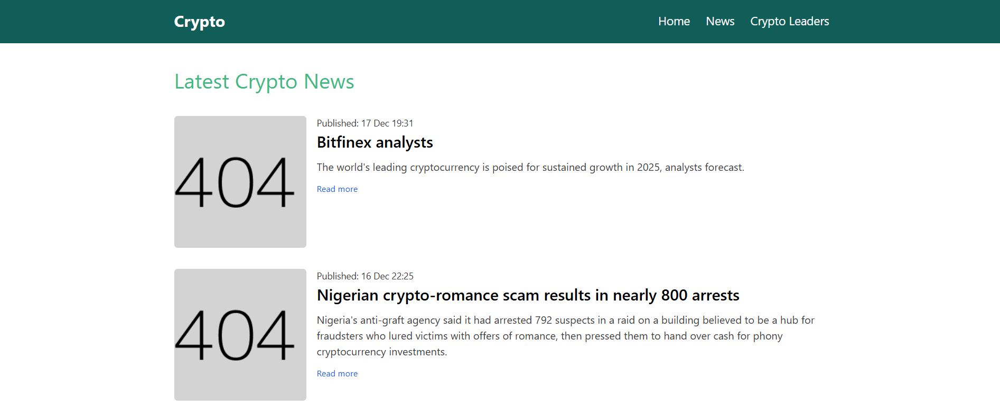

# Crypto Info and News - Vue Project

Este es un proyecto de Vue.js que hace Fetch de los datos de las API de criptomonedas y los muestra en tres páginas principales:

1. _Home Page_ - información de criptomonedas, como nombre, precio, volumen de 24 horas y capitalización de mercado.
2. _News Page_ - las últimas noticias sobre criptomonedas.
3. _Leaders Page_ - una lista de líderes de la industria de las criptomonedas.

## Features

- _Home Page_:
  - Hace fetch y muestra información sobre criptomonedas:
    - Nombre
    - Precio
    - Volumen 24h
    - Capitalización de mercado
  - Datos obtenidos de una API pública de criptomonedas (CoinGecko & Gnews)
- _News Page_:
  - Hace fetch y muestra los últimos titulares de noticias sobre criptomonedas.
  - Datos obtenidos de una API de criptonoticias.
- _Crypto Industry Leaders_:
  - Muestra una lista de líderes de la industria de las criptomonedas.

## Paginas

### 1. _Home Page_ (/)

Esta página obtiene datos de criptomonedas y muestra:

- _Name_
- _Price_
- _24h Volume_
- _Market Cap_

Obtiene estos datos de una API pública y actualiza dinámicamente la página.

#### Screenshot of Home Page:

### 2. _News Page_ (/news)

Esta página obtiene los últimos titulares de noticias sobre criptomonedas de una API de noticias sobre criptomonedas y los muestra en formato de lista.

#### Screenshot of News Page:

### 3. _Leaders Page_ (/leaders)

Esta página muestra una lista de líderes de la industria de las criptomonedas, brindando breves descripciones y sus contribuciones al mundo de las criptomonedas.

#### Screenshot of Leaders Page:

## API Integration

### Crypto Info API

Los datos de la Home Page se obtienen de una API de criptomonedas que proporciona datos en tiempo real sobre:

- Precio
- Capitalización de mercado
- Volumen 24h

### News API

Las últimas noticias sobre criptomonedas se obtienen de una API de noticias públicas Gnews que proporciona titulares, resúmenes de artículos y enlaces a artículos completos.

## Routing and State Management

- _Vue Router_: para navegar entre las tres páginas (/, /news, /leaders).
- _Vuepenia_: para gestionar el estado de la aplicación. Almacena los datos obtenidos y los proporciona en diferentes páginas de la aplicación.

## Styling

- _Tailwind CSS_ para un estilo responsivo y que prioriza la utilidad
